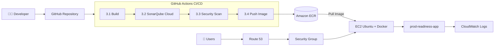

<h1 align="center">🚀 DevSecOps Production Readiness Architecture</h1>

<p align="center">
  <b>Secure CI/CD Pipeline with Automated Security Scanning and Deployment on AWS</b>
</p>

<p align="center">
  
  
  
  
</p>

<p align="center">
  
  
  
  
</p>

<p align="center">
  <b>Security → Build → Scan → Release → Deploy → Verify → Monitor</b>
</p>

---

## 📌 Overview

This project implements an automated **DevSecOps CI/CD pipeline** for a containerized **Node.js (Express)** application on AWS.

Code pushed to GitHub is built, checked for code quality, scanned for secrets, Dockerfile issues, dependency and image vulnerabilities, pushed to a private **Amazon ECR** registry, and deployed to an **Ubuntu EC2** instance running a hardened Docker container. **Amazon CloudWatch** collects application logs, metrics and alarms, and users reach the app through **Route 53**.

---

## 🏗️ Architecture




---

## 🔄 Pipeline Stages

| Step | Stage | Tools |
| :--: | ----- | ----- |
| 1 | Developer | Write and push code |
| 2 | GitHub Repository | `Mahendra0456/prod-readiness` (main branch) |
| 3.1 | Build | Docker |
| 3.2 | Code Scan | SonarQube Cloud |
| 3.3 | Security Scan | Trivy, Gitleaks, Hadolint, npm audit |
| 3.4 | Push Image | Amazon ECR (`latest` and commit SHA tags) |
| 4 | Registry | Amazon ECR (private) |
| 5 | Pull Image | EC2 pulls the image from ECR |
| 6 | Deploy | Docker container on Ubuntu EC2 |
| 7 | Monitor | CloudWatch logs, metrics, alarms |

---

## 🛡️ Security Scanning

| Tool | Purpose | Command / Config |
| ---- | ------- | ---------------- |
| **SonarQube Cloud** | Static code analysis: bugs, vulnerabilities, code smells | `sonar-project.properties` |
| **Gitleaks** | Detects committed secrets (keys, tokens, passwords) | `gitleaks/gitleaks-action@v2` |
| **Hadolint** | Dockerfile best practices and security | `hadolint Dockerfile` |
| **npm audit** | Known vulnerabilities in dependencies | `npm audit --audit-level=high` |
| **Trivy (fs)** | Filesystem vulnerabilities, secrets, misconfigurations | `scan-type: fs` |
| **Trivy (image)** | Docker image vulnerabilities before release | `scan-type: image` |

Trivy is configured for `HIGH` and `CRITICAL` findings with `ignore-unfixed: true`, so the pipeline fails when a matching issue is found.

---

## 📦 Amazon ECR

Images are pushed to a private repository with two tags:

```text
prod-readiness:latest
prod-readiness:<commit-sha>
```

The commit SHA tag links every deployed image to the exact Git commit that produced it.

---

## 🔑 GitHub OIDC → AWS

GitHub Actions authenticates to AWS with **OIDC**, so no long-lived AWS access keys are stored in GitHub Secrets.

```text
GitHub Actions → GitHub OIDC token → AWS IAM role → Temporary credentials → Amazon ECR
```

IAM role: `GitHubActionsProdReadiness`

---

## 🌐 Networking and Access

```text
Users → Internet → Route 53 → Security Group → EC2 (Ubuntu) → Docker → Node.js app
```

| Security Group Rule | Port |
| ------------------- | :--: |
| HTTP (inbound) | 80 |
| SSH (inbound) | 22 |

> ⚠️ For real production use, restrict SSH (port 22) to a trusted IP address or use AWS Systems Manager Session Manager.

The container listens on port `3000` internally and is published on port `80`.

---

## 🖥️ Deployment

GitHub Actions deploys to EC2 over SSH:

1. Log in to Amazon ECR
2. Pull the commit-SHA image
3. Stop the previous container
4. Start the new hardened container
5. Run the `/health` check

---

## 🐳 Container Hardening

| Control | Implementation |
| ------- | -------------- |
| Non-root user | `USER 1000` |
| Read-only filesystem | `--read-only` |
| Drop Linux capabilities | `--cap-drop ALL` |
| No privilege escalation | `--security-opt no-new-privileges:true` |
| CPU and memory limits | `--cpus="1"` `--memory="512m"` |
| Restart policy | `--restart unless-stopped` |
| Health check | `/health` endpoint |
| Cloud logging | `awslogs` driver |

```bash
docker run -d \
  --name prod-readiness \
  --restart unless-stopped \
  --read-only \
  --cap-drop ALL \
  --security-opt no-new-privileges:true \
  --cpus="1" \
  --memory="512m" \
  --log-driver awslogs \
  --log-opt awslogs-region=ap-south-1 \
  --log-opt awslogs-group=/prod-readiness \
  --log-opt awslogs-stream=app \
  -p 80:3000 \
  "$IMAGE"
```

---

## ❤️ Health Check

```text
GET /health
```

```json
{
  "status": "ok"
}
```

```bash
curl -f http://localhost/health
```

---

## 📊 Monitoring

Container logs are sent to **Amazon CloudWatch Logs** through the Docker `awslogs` driver.

| Setting | Value |
| ------- | ----- |
| Log group | `/prod-readiness` |
| Log stream | `app` |

CloudWatch provides application logs, metrics and alarms.

---

## 🧪 Run Locally

```bash
git clone https://github.com/Mahendra0456/prod-readiness.git
cd prod-readiness
npm ci
npm start
```

```bash
curl http://localhost:3000/
curl http://localhost:3000/health
```

### With Docker

```bash
docker build -t prod-readiness .
docker run -d --name prod-readiness-test -p 3000:3000 prod-readiness
curl http://localhost:3000/health
docker rm -f prod-readiness-test
```

### Local security scans

```bash
npm audit --audit-level=high
hadolint Dockerfile
trivy fs .
trivy image prod-readiness
```

---

## 📁 Project Structure

```text
prod-readiness/
├── .github/
│   └── workflows/
│       └── ci.yml
├── docs/
│   └── architecture.png
├── app.js
├── package.json
├── package-lock.json
├── Dockerfile
├── .dockerignore
├── sonar-project.properties
└── README.md
```

---

## 🛠️ Tech Stack

| Category | Technology |
| -------- | ---------- |
| Cloud | AWS (VPC, EC2, ECR, Route 53, CloudWatch, IAM) |
| CI/CD | GitHub Actions, GitHub OIDC |
| Containers | Docker |
| Application | Node.js 20, Express.js |
| OS | Ubuntu |
| Code quality | SonarQube Cloud |
| Security | Trivy, Gitleaks, Hadolint, npm audit |

---

## 🎯 Key Features

- 🔄 Fully automated CI/CD pipeline
- 🔐 Keyless AWS authentication with GitHub OIDC
- 🛡️ Six security and quality checks before release
- 📦 Private Amazon ECR registry with commit-SHA traceability
- 🐳 Hardened, non-root, read-only container
- ❤️ Automated health verification after deployment
- 📊 Centralized logging with CloudWatch

---

## 🔒 Security Note

Never commit AWS keys, SSH private keys, GitHub tokens, SonarQube tokens or application secrets. Use GitHub Secrets and AWS IAM/OIDC instead.

---

## 👨‍💻 Author

**Mahendra Swain** · Junior DevOps & Cloud Engineer

[](https://github.com/Mahendra0456)
[](https://linkedin.com/in/mahendra-swain)

---

<p align="center">
  <b>⭐ If you found this useful, consider starring the repo.</b>
</p>
